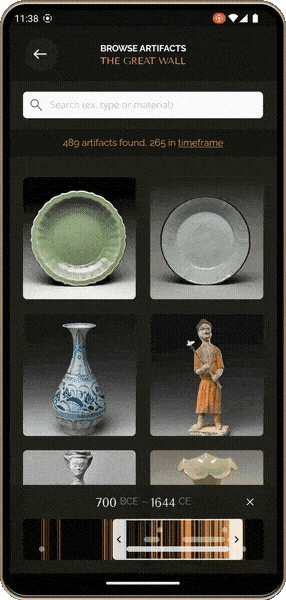
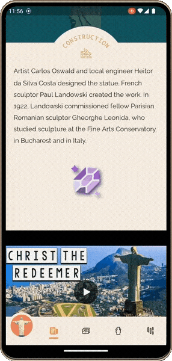

</img>
<h1 align="center">
Marvelous .NET MAUI
</h1>

**.NET MAUI clone** of the [Wonderous app](https://flutter.gskinner.com/wonderous/) - a visual showcase of **eight wonders of the world** made with [Flutter](https://github.com/flutter/flutter) by the team at [gskinner](https://gskinner.com/).

https://user-images.githubusercontent.com/65116078/221362876-a51bf65e-8b8e-416c-8ef9-c56f57e792ea.mp4

This project demonstrates how to develop **tailored UI** using .NET MAUI. However, Marvelous .NET MAUI is not just a demonstration, it is a **fully functional app** that allows users to navigate the intersection of history, art, and culture by exploring the Wonders of the World.

Thanks to the original version of the app, you can also find out how well .NET MAUI competes against Flutter, for example in terms of app performance.

## Installation

First, make sure you have your Visual Studio and .NET 7 environment set up for .NET MAUI development. If not, follow the [setup instructions](https://learn.microsoft.com/dotnet/maui/get-started/installation). Then make sure you have your [Android](https://learn.microsoft.com/dotnet/maui/get-started/first-app?pivots=devices-android) or [iOS](https://learn.microsoft.com/dotnet/maui/get-started/first-app?pivots=devices-ios) platform set up for deployment of the application.

Once everything is set up, you can clone the repo and run the application via Visual Studio.

Here are some resources to learn more about .NET MAUI:

- [Official website](https://dotnet.microsoft.com/apps/maui)
- [Microsoft Learn](https://learn.microsoft.com/dotnet/maui/what-is-maui)
- [.NET MAUI GitHub repository](https://github.com/dotnet/maui)

## Original app

The original Wonderous app is a reference app that shows how to develop tailored UI using Flutter.

 

Here are some resources to learn more about the app and the amazing team that created it:

- [Official Wonderous website](https://flutter.gskinner.com/wonderous/)
- [Wonderous GitHub repository](https://github.com/gskinnerTeam/flutter-wonderous-app)
- [Blog post about the goals of the app](https://medium.com/flutter/wonderous-explore-the-world-with-flutter-f43cce052e1)
- [YouTube video showcasing Wonderous](https://www.youtube.com/watch?v=6Hb3QiH_yps)
- [YouTube video about Wonderous by Flutter](https://www.youtube.com/watch?v=6IKhXXFFOuw)
- [gskinner website](https://gskinner.com/)

## Features

Wonderous .NET MAUI has highly expressive user interface, tailored to the mobile form factor, and does not conform to a stock design system. Only the .NET MAUI APIs and a few community libraries are used to achieve this level of expressiveness:

- [.NET MAUI Community Toolkit](https://github.com/CommunityToolkit/Maui) - collection of common elements for development with .NET MAUI that developers tend to replicate across multiple apps
- [SimpleToolkit](https://github.com/RadekVyM/SimpleToolkit) - library of helpers and simple, easily customizable controls
- [Draggable Grid](https://github.com/RadekVyM/Draggable-Grid-JS) - JavaScript control that allows you to arrange items of an unordered list into a grid and to move between them by dragging

### Remarkable carousel view
Unique, custom-built carousel view which lets you to switch between all eight wonders of the world.

    
    &nbsp;&nbsp;
    

### Unique scroll patterns
Unique scroll patterns and effects as you move through various pages.

    
    &nbsp;&nbsp;
    

### Custom controls
Tailored buttons, icons and other controls that match the Wonderous design system. Some of them are just compositions of existing .NET MAUI controls, and some are (almost completely) drawn using .NET MAUI cross-platform drawing APIs, such as a slider to select the period of the currently displayed artifacts.

    
    &nbsp;&nbsp;
    

### Animations everywhere
The application is full of animations, they can be found on each page.

    
    &nbsp;&nbsp;
    

### Blazor/JavaScript component
The wonder photo gallery is created using the [Draggable Grid](https://github.com/RadekVyM/Draggable-Grid-JS) JavaScript control which is embedded via `BlazorWebView`.

    

## License

As with the original app ([license](https://github.com/gskinnerTeam/flutter-wonderous-app/blob/main/LICENSE)), source code of this app is released under the MIT license. You can use the code for any purpose, including commercial projects.

However, **visual assets are copyrighted** and **used with permission** from Google. Please visit the [Wonderous GitHub repository](https://github.com/gskinnerTeam/flutter-wonderous-app) for original version of the assets.
